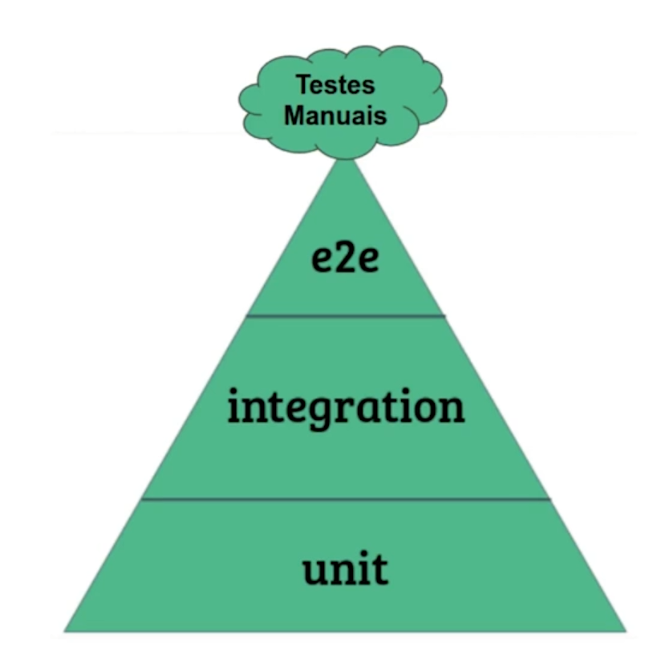
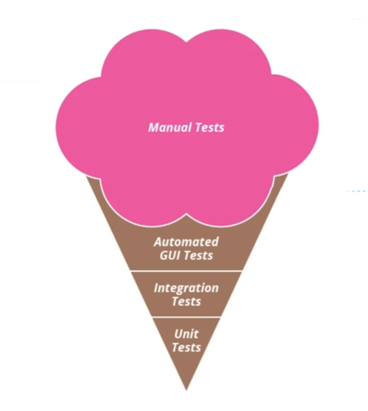

# Diferentes tipo de testes automatizados que existem

## Seguindo a organização da pirâmide de teste dos nossos testes em um sistema

<strong>1° Testes de unidade:</strong> Deve ser a maior quantidade de testes. 
<strong>2° Testes de integração</strong> 
<strong>3° Teste de Interface (teste de ponta a ponta, do sistema funcionando em si):</strong> Deve ser a menor quantidade de testes. 
<strong>4° Testes manuais:</strong> Devem ser feitos pontualmente.

## Testes de Unidade (e não "unitários")

Um teste de unidade, é um teste que verifica o funcioanmento da menor unidade possivel, da menor unidade testável.
Ex: método publico de uma classe

> Se a classe tiver dependencias precisamos utilizar os "dubles de classes" Ex: mocks, para conseguirmos de fato fazer um teste de unidade
> Criamos esses dubles para realizar o trabalho da forma que ja esperamos (conseguimos definir como vão se comportar) para que as dependencias nãoa fetem no teste

## Testes de Integração

São os testes em que utilizamos mais de uma classe real para realizar um teste, ou, é mais conhecido um teste de integração, um teste que realiza persistencia de BD, que chama alguma API externa,
ou seja, é mais conhecido com um teste de integração um teste que combina funcioanalidades do seu código com um sistema externo.

## Testes de ponta a ponta | (Testes de interface) | (e2e - end-to-end)

É testar o sistema real em funcionamento em um ambiente controlado.

## Expectativa vs Realidade

| O que deve ser feito                                           |                                     O que realmente é feito     |
|----------------------------------------------------------------|-----------------------------------------------------------------|
|  |    |

> O que deveria ser algo pontual, para funcionalidades específicas, na realidade é o principal, sendo algo mais demorado e mais custoso.

## ⚠️ Importante

Seguir a piramide de teste resulta em um teste mais agil.
