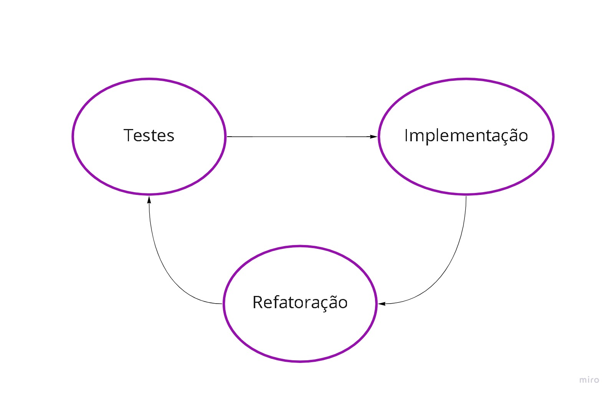

# TDD e Java: testes automatizados com JUnit
O JUnit é a principal biblioteca Java utilizada para escrever os chamados testes de unidade, que nos permitem saber rapidamente se o código está funcionando conforme o esperado, ou mesmo se mudanças nesse código tenham impactado de alguma maneira no projeto.

## Testes automatizados
> Teste automatizado é como uma simulação do uso daquela classe, ou seja, é necessário instanciar, chamar um método, passar parâmetros, pegar o retorno e assim por diante.

✅ <strong>Automatização de ações repetitivas:</strong> o passo a passo é sempre igual, portanto, sempre será executado da mesma maneira pela máquina.

✅ <strong>Feedback mais rápido:</strong> como é um código que vai executar o teste, ele o faz de maneira muito mais rápida que um ser humano, agilizando também a identificação de falhas.

✅ <strong>Segurança para mudar o código:</strong> tendemos a ficar mais seguros para modificar códigos de outras pessoas porque, após a mudança, basta fazer o teste automatizado para identificar possíveis erros.

✅ <strong>Favorecimento de melhorias:</strong> ao sentirmos mais segurança para modificar um código, também tendemos a implementar melhorias (o chamado refactoring), para deixar tudo mais simples e organizado.

✅ Garante que o código da aplicação atende corretamente aos requisitos de negócio.

## JUnit
> Biblioteca padrão para escrita de testes automatizados em java

✅ JUnit tem o foco em teste de unindade (testes unitários)

✅ As IDEs possuem plugins de integração com o JUnit, facilitando a análise dos resultados dos testes executados.

O JUnit simplifica a maneira de testar, não precisando ter o método main, imprimir para ver o resultado, ou seja, vamos escrever o teste de maneira mais simples, elegante e mais fácil de escrever, executar e analisar.    

<strong>pom.xml:</strong> Esse arquivo é usado para definir algumas configurações do projeto. Dentre elas, as dependências da aplicação, também usadas para adicionar o JUnit ao projeto, ou seja, em vez de usarmos a integração com a IDE, vamos adicionar o JUnit como uma dependência do Maven (ou de outra ferramenta de gestão de dependências).

## TDD: Test-Driven Development (Desenvolvimento Orientado/guiado a Testes)

No TDD, escrevemos o teste, implementamos o mínimo necessário para ele funcionar corretamente num determinado cenário e passamos por uma terceira etapa que é a refatoração (ou refactoring), prática usada para melhorar um código existente sem mudar seu comportamento.

A ideia é que, após escrever um teste e implementá-lo sem falhas, possamos revisar o código da implementação para deixá-lo mais funcional e organizado (melhorar os nomes de variáveis, reduzir a quantidade de if elses, etc.).

### Vantagens:
✅ <strong>Código já sai "testado"</strong> Na abordagem tradicional (implementação primeiro e depois teste), o fato de deixarmos o teste por último faz com que muitas pessoas pulem essa etapa. Especialmente se estamos trabalhando com uma funcionalidade muito complexa. No TDD, isso não acontece porque a escrita do teste é a primeira etapa do processo.

✅ <strong>Evita testes "viciados" na implementação</strong> Ao começar pelo teste, evitamos a prática de "testes viciados", ou seja, quando escrevemos o teste pensando na implementação. "Como assim?". Às vezes, a implementação influencia a escrita do código. São aqueles casos nos quais, por exemplo, se usamos um if e um for na implementação, repetimos essa estrutura ao escrever o teste.

> Teste é voltado para o comportamento e não para "aquela" implementação em específico, ou seja,  teste tem que ser voltado para garantir um determinado comportamento, independentemente de como vai ser feita a sua implementação.

✅ <strong>Refatoração:</strong> Permite melhorias no código de maneira contínua. Às vezes, na correria, não testamos nem refatoramos nossos códigos. A longo prazo, isso é uma vantagem porque significa que temos um código com uma boa cobertura de testes e de boa qualidade.

✅ <strong>Ajuda a manter o foco:</strong>  Às vezes, estamos pensando em milhões de coisas em simultâneo, enquanto escrevemos um código. Isso pode levar à criação de estruturas desnecessárias e ao erro. No TDD, implementamos um cenário de cada vez, mantendo o foco nele até o fim do ciclo.

✅ <strong>Tendência a escrever um código mais simples:</strong> Quando usamos o TDD, tendemos a escrever um código mais simples, tanto para o teste quando para a implementação. Esse não é um benefício automático, mas tende a acontecer naturalmente conforme adquirimos experiência. Isso porque, ao começar pelo teste, queremos que ele seja o mais simples possível para podermos partir logo para a implementação.

### Quando utilizar TDD?
Usar o TDD para implementar funcionalidades complexas, cuja estrutura ainda não está totalmente clara desde o começo. Nesses casos, o TDD é de grande ajuda porque funciona como um rascunho.

Porém, ao trabalhar com códigos mais simples, sem muitos problemas de design, talvez não valha a pena usar o TDD porque não vamos sentir tanto os seus benefícios.